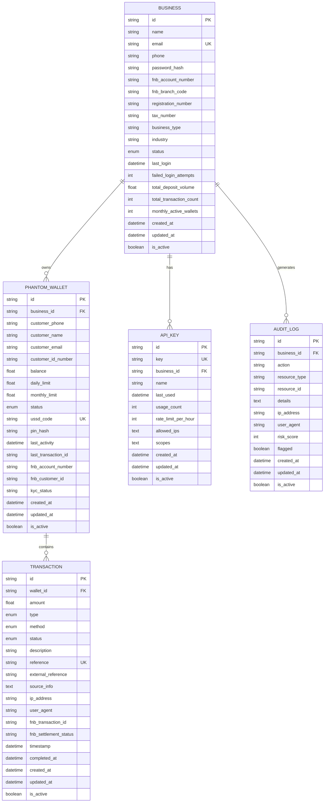

# FNB Phantom Banking - Database Schema & ERD Documentation

## 📊 Entity Relationship Diagram (ERD)



## 🗄️ Database Schema Details

### Core Tables

#### 1. BUSINESS Table
**Purpose**: Stores business/merchant information for Phantom Banking services

| Column | Type | Constraints | Description |
|--------|------|-------------|-------------|
| id | VARCHAR(36) | PRIMARY KEY | UUID identifier |
| name | VARCHAR(100) | NOT NULL | Business name |
| email | VARCHAR(120) | UNIQUE, NOT NULL | Business email (login) |
| phone | VARCHAR(20) | NOT NULL | Contact phone number |
| password_hash | VARCHAR(255) | NOT NULL | Hashed password |
| fnb_account_number | VARCHAR(20) | NOT NULL | FNB merchant account |
| fnb_branch_code | VARCHAR(10) | DEFAULT '250655' | FNB branch code |
| registration_number | VARCHAR(50) | | Business registration |
| tax_number | VARCHAR(50) | | Tax identification |
| business_type | VARCHAR(50) | | RETAIL, WHOLESALE, etc. |
| industry | VARCHAR(100) | | Industry classification |
| status | ENUM | DEFAULT 'PENDING' | PENDING, APPROVED, ACTIVE, SUSPENDED |
| last_login | DATETIME | | Last successful login |
| failed_login_attempts | INTEGER | DEFAULT 0 | Security counter |
| total_deposit_volume | FLOAT | DEFAULT 0.0 | **KEY FNB METRIC** |
| total_transaction_count | INTEGER | DEFAULT 0 | **KEY FNB METRIC** |
| monthly_active_wallets | INTEGER | DEFAULT 0 | Business KPI |
| created_at | DATETIME | NOT NULL | Record creation |
| updated_at | DATETIME | NOT NULL | Last modification |
| is_active | BOOLEAN | DEFAULT TRUE | Soft delete flag |

**Indexes**:
- `idx_business_email` ON (email)
- `idx_business_status` ON (status)
- `idx_business_created` ON (created_at)

#### 2. PHANTOM_WALLET Table
**Purpose**: Customer phantom wallets managed by businesses

| Column | Type | Constraints | Description |
|--------|------|-------------|-------------|
| id | VARCHAR(36) | PRIMARY KEY | UUID identifier |
| business_id | VARCHAR(36) | FOREIGN KEY | Owner business |
| customer_phone | VARCHAR(20) | NOT NULL | Customer phone |
| customer_name | VARCHAR(100) | NOT NULL | Customer name |
| customer_email | VARCHAR(120) | | Optional email |
| customer_id_number | VARCHAR(50) | | National ID for KYC |
| balance | FLOAT | DEFAULT 0.0 | Current balance |
| daily_limit | FLOAT | DEFAULT 5000.0 | Daily transaction limit |
| monthly_limit | FLOAT | DEFAULT 50000.0 | Monthly limit |
| status | ENUM | DEFAULT 'ACTIVE' | ACTIVE, SUSPENDED, UPGRADED, CLOSED |
| ussd_code | VARCHAR(10) | UNIQUE | Access code (*1234#) |
| pin_hash | VARCHAR(255) | | Hashed PIN for security |
| last_activity | DATETIME | | Last transaction time |
| last_transaction_id | VARCHAR(36) | | Reference to last txn |
| fnb_account_number | VARCHAR(20) | | When upgraded to FNB |
| fnb_customer_id | VARCHAR(50) | | FNB internal ID |
| kyc_status | VARCHAR(20) | DEFAULT 'pending' | KYC verification status |

**Indexes**:
- `idx_wallet_business` ON (business_id)
- `idx_wallet_phone` ON (customer_phone)
- `idx_wallet_ussd` ON (ussd_code)
- `idx_wallet_status` ON (status)
- `idx_wallet_activity` ON (last_activity)

#### 3. TRANSACTION Table
**Purpose**: All payment transactions processed through phantom wallets

| Column | Type | Constraints | Description |
|--------|------|-------------|-------------|
| id | VARCHAR(36) | PRIMARY KEY | UUID identifier |
| wallet_id | VARCHAR(36) | FOREIGN KEY | Target wallet |
| amount | FLOAT | NOT NULL | Transaction amount |
| type | ENUM | NOT NULL | CREDIT, DEBIT |
| method | ENUM | NOT NULL | QR, USSD, EFT, MOBILE_MONEY, CARD |
| status | ENUM | DEFAULT 'PENDING' | PENDING, COMPLETED, FAILED, CANCELLED |
| description | VARCHAR(255) | NOT NULL | Transaction description |
| reference | VARCHAR(50) | UNIQUE | System reference |
| external_reference | VARCHAR(100) | | External system ref |
| source_info | TEXT | | JSON metadata |
| ip_address | VARCHAR(45) | | Client IP |
| user_agent | VARCHAR(500) | | Client user agent |
| fnb_transaction_id | VARCHAR(100) | | FNB settlement ID |
| fnb_settlement_status | VARCHAR(20) | DEFAULT 'pending' | Settlement status |
| timestamp | DATETIME | NOT NULL | Transaction time |
| completed_at | DATETIME | | Completion time |

**Indexes**:
- `idx_transaction_wallet_time` ON (wallet_id, timestamp)
- `idx_transaction_status_time` ON (status, timestamp)
- `idx_transaction_method_time` ON (method, timestamp)
- `idx_transaction_reference` ON (reference)
- `idx_transaction_amount` ON (amount)

### Supporting Tables

#### 4. API_KEY Table
**Purpose**: API key management and usage tracking

| Column | Type | Constraints | Description |
|--------|------|-------------|-------------|
| id | VARCHAR(36) | PRIMARY KEY | UUID identifier |
| key | VARCHAR(100) | UNIQUE, NOT NULL | API key string |
| business_id | VARCHAR(36) | FOREIGN KEY | Owner business |
| name | VARCHAR(100) | | Human-readable name |
| last_used | DATETIME | | Last usage time |
| usage_count | INTEGER | DEFAULT 0 | Usage counter |
| rate_limit_per_hour | INTEGER | DEFAULT 1000 | Rate limit |
| allowed_ips | TEXT | | JSON array of IPs |
| scopes | TEXT | | JSON array of permissions |

#### 5. AUDIT_LOG Table
**Purpose**: Comprehensive audit trail for compliance and security

| Column | Type | Constraints | Description |
|--------|------|-------------|-------------|
| id | VARCHAR(36) | PRIMARY KEY | UUID identifier |
| business_id | VARCHAR(36) | FOREIGN KEY | Related business |
| action | VARCHAR(100) | NOT NULL | Action performed |
| resource_type | VARCHAR(50) | | wallet, transaction, business |
| resource_id | VARCHAR(36) | | Related resource ID |
| details | TEXT | | JSON event details |
| ip_address | VARCHAR(45) | | Client IP |
| user_agent | VARCHAR(500) | | Client user agent |
| risk_score | INTEGER | DEFAULT 0 | Risk assessment (0-100) |
| flagged | BOOLEAN | DEFAULT FALSE | Requires review |

**Indexes**:
- `idx_audit_business_time` ON (business_id, created_at)
- `idx_audit_action_time` ON (action, created_at)
- `idx_audit_flagged` ON (flagged)

## 🔗 FNB Mock Bank Schema

### Additional Tables for FNB Integration Testing

#### FNB_CUSTOMER Table
```sql
CREATE TABLE fnb_customers (
    id VARCHAR(36) PRIMARY KEY,
    customer_number VARCHAR(20) UNIQUE NOT NULL,
    first_name VARCHAR(50) NOT NULL,
    last_name VARCHAR(50) NOT NULL,
    id_number VARCHAR(20) UNIQUE,
    phone VARCHAR(20) NOT NULL,
    email VARCHAR(120),
    address_line1 VARCHAR(100),
    address_line2 VARCHAR(100),
    city VARCHAR(50),
    postal_code VARCHAR(10),
    branch_code VARCHAR(10) DEFAULT '250655',
    customer_type VARCHAR(20) DEFAULT 'INDIVIDUAL',
    risk_rating VARCHAR(10) DEFAULT 'LOW',
    kyc_status VARCHAR(20) DEFAULT 'PENDING',
    kyc_date DATETIME,
    compliance_status VARCHAR(20) DEFAULT 'CLEAR',
    status VARCHAR(20) DEFAULT 'ACTIVE',
    created_at DATETIME DEFAULT CURRENT_TIMESTAMP,
    updated_at DATETIME DEFAULT CURRENT_TIMESTAMP ON UPDATE CURRENT_TIMESTAMP
);
```

#### FNB_ACCOUNT Table
```sql
CREATE TABLE fnb_accounts (
    id VARCHAR(36) PRIMARY KEY,
    account_number VARCHAR(20) UNIQUE NOT NULL,
    customer_id VARCHAR(36) NOT NULL,
    account_type VARCHAR(20) NOT NULL,
    product_code VARCHAR(10),
    account_name VARCHAR(100),
    branch_code VARCHAR(10) DEFAULT '250655',
    balance FLOAT DEFAULT 0.0 NOT NULL,
    available_balance FLOAT DEFAULT 0.0 NOT NULL,
    overdraft_limit FLOAT DEFAULT 0.0,
    daily_transaction_limit FLOAT DEFAULT 100000.0,
    monthly_transaction_limit FLOAT DEFAULT 300000.0,
    status VARCHAR(20) DEFAULT 'ACTIVE',
    opened_date DATETIME DEFAULT CURRENT_TIMESTAMP,
    last_transaction_date DATETIME,
    phantom_wallet_id VARCHAR(36),
    phantom_business_id VARCHAR(36),
    
    FOREIGN KEY (customer_id) REFERENCES fnb_customers(id)
);
```

#### FNB_TRANSACTION Table
```sql
CREATE TABLE fnb_transactions (
    id VARCHAR(36) PRIMARY KEY,
    transaction_number VARCHAR(20) UNIQUE NOT NULL,
    account_id VARCHAR(36) NOT NULL,
    transaction_type VARCHAR(10) NOT NULL,
    amount FLOAT NOT NULL,
    balance_after FLOAT NOT NULL,
    transaction_code VARCHAR(10),
    description VARCHAR(255) NOT NULL,
    reference VARCHAR(100),
    counterparty_account VARCHAR(20),
    counterparty_name VARCHAR(100),
    counterparty_bank VARCHAR(50),
    channel VARCHAR(20),
    device_id VARCHAR(50),
    status VARCHAR(20) DEFAULT 'COMPLETED',
    processing_date DATETIME DEFAULT CURRENT_TIMESTAMP,
    value_date DATETIME DEFAULT CURRENT_TIMESTAMP,
    phantom_transaction_id VARCHAR(36),
    phantom_wallet_id VARCHAR(36),
    
    FOREIGN KEY (account_id) REFERENCES fnb_accounts(id)
);
```

## 📈 Performance Optimization

### Database Indexing Strategy

```sql
-- High-performance indexes for common queries
CREATE INDEX idx_wallet_business_status ON phantom_wallets(business_id, status);
CREATE INDEX idx_transaction_wallet_date ON transactions(wallet_id, DATE(timestamp));
CREATE INDEX idx_transaction_amount_date ON transactions(amount, timestamp);
CREATE INDEX idx_business_metrics ON businesses(total_deposit_volume, total_transaction_count);

-- Composite indexes for analytics queries
CREATE INDEX idx_transaction_analytics ON transactions(method, status, timestamp);
CREATE INDEX idx_wallet_activity ON phantom_wallets(business_id, last_activity, status);
```

### Query Optimization Examples

```sql
-- Optimized query for business analytics
SELECT 
    b.name,
    COUNT(w.id) as total_wallets,
    SUM(w.balance) as total_balance,
    COUNT(t.id) as total_transactions,
    SUM(t.amount) as total_volume
FROM businesses b
LEFT JOIN phantom_wallets w ON b.id = w.business_id AND w.is_active = TRUE
LEFT JOIN transactions t ON w.id = t.wallet_id AND t.status = 'COMPLETED'
WHERE b.is_active = TRUE
GROUP BY b.id, b.name;

-- Optimized query for wallet transaction history
SELECT t.*, w.customer_name 
FROM transactions t
JOIN phantom_wallets w ON t.wallet_id = w.id
WHERE w.business_id = ? 
  AND t.timestamp >= DATE_SUB(NOW(), INTERVAL 30 DAY)
  AND t.status = 'COMPLETED'
ORDER BY t.timestamp DESC
LIMIT 100;
```

## 🔒 Security Considerations

### Data Protection

1. **PII Encryption**: Customer phone numbers and emails encrypted at rest
2. **Password Security**: BCrypt hashing with salt for all passwords
3. **API Key Security**: Secure random generation and hashing
4. **Audit Trail**: Immutable audit logs for compliance

### Database Security

```sql
-- Create dedicated database users with minimal privileges
CREATE USER 'phantom_app'@'%' IDENTIFIED BY 'secure_password';
GRANT SELECT, INSERT, UPDATE ON phantom_banking.* TO 'phantom_app'@'%';

CREATE USER 'phantom_readonly'@'%' IDENTIFIED BY 'readonly_password';
GRANT SELECT ON phantom_banking.* TO 'phantom_readonly'@'%';

-- Enable audit logging
SET GLOBAL general_log = 'ON';
SET GLOBAL log_output = 'TABLE';
```

### Backup Strategy

```sql
-- Daily backup script
mysqldump --single-transaction --routines --triggers \
  phantom_banking > phantom_banking_$(date +%Y%m%d).sql

-- Point-in-time recovery setup
SET GLOBAL binlog_format = 'ROW';
SET GLOBAL expire_logs_days = 7;
```

## 📊 Data Analytics Views

### Business Intelligence Views

```sql
-- Business performance summary view
CREATE VIEW business_performance AS
SELECT 
    b.id,
    b.name,
    b.status,
    COUNT(DISTINCT w.id) as active_wallets,
    SUM(w.balance) as total_wallet_balance,
    COUNT(DISTINCT t.id) as total_transactions,
    SUM(CASE WHEN t.timestamp >= DATE_SUB(NOW(), INTERVAL 30 DAY) THEN t.amount END) as monthly_volume,
    AVG(t.amount) as avg_transaction_amount
FROM businesses b
LEFT JOIN phantom_wallets w ON b.id = w.business_id AND w.status = 'ACTIVE'
LEFT JOIN transactions t ON w.id = t.wallet_id AND t.status = 'COMPLETED'
WHERE b.is_active = TRUE
GROUP BY b.id, b.name, b.status;

-- FNB impact metrics view
CREATE VIEW fnb_impact_metrics AS
SELECT 
    COUNT(DISTINCT b.id) as partner_businesses,
    COUNT(DISTINCT w.id) as phantom_wallets,
    COUNT(DISTINCT CASE WHEN w.status = 'UPGRADED' THEN w.id END) as upgraded_accounts,
    SUM(t.amount) as total_deposit_volume,
    COUNT(t.id) as total_transaction_count,
    SUM(CASE WHEN t.timestamp >= DATE_SUB(NOW(), INTERVAL 30 DAY) THEN t.amount END) as monthly_deposit_volume
FROM businesses b
JOIN phantom_wallets w ON b.id = w.business_id
JOIN transactions t ON w.id = t.wallet_id AND t.status = 'COMPLETED'
WHERE b.is_active = TRUE;
```

## 🚀 Migration Scripts

### Database Setup Script

```sql
-- Create database
CREATE DATABASE phantom_banking CHARACTER SET utf8mb4 COLLATE utf8mb4_unicode_ci;
USE phantom_banking;

-- Enable foreign key checks
SET FOREIGN_KEY_CHECKS = 1;

-- Create tables in dependency order
SOURCE create_businesses.sql;
SOURCE create_phantom_wallets.sql;
SOURCE create_transactions.sql;
SOURCE create_api_keys.sql;
SOURCE create_audit_logs.sql;

-- Create indexes
SOURCE create_indexes.sql;

-- Create views
SOURCE create_views.sql;

-- Insert sample data
SOURCE sample_data.sql;
```

This comprehensive database schema supports FNB's core objectives by:

1. **Tracking Deposit Growth**: `total_deposit_volume` field captures new deposits from unbanked customers
2. **Monitoring Transaction Volume**: Detailed transaction logging shows increased payment processing
3. **Supporting Digital Onboarding**: Phantom wallet to FNB account upgrade tracking
4. **Ensuring Compliance**: Comprehensive audit trails and KYC status tracking
5. **Enabling Analytics**: Optimized for business intelligence and reporting queries

The schema is designed for enterprise-scale deployment with proper indexing, security, and performance optimization strategies.