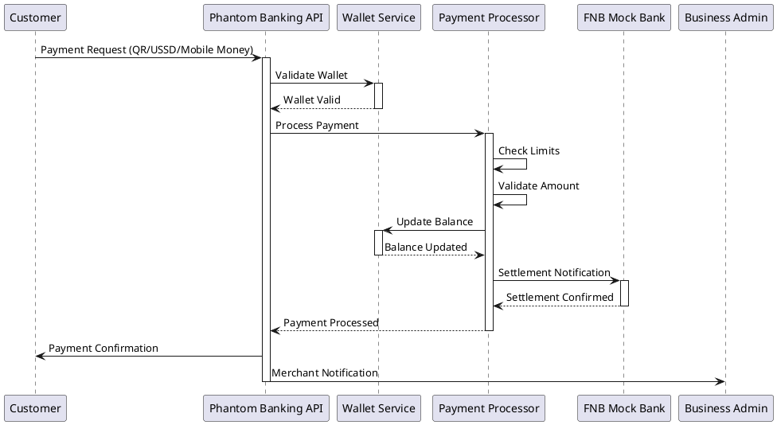
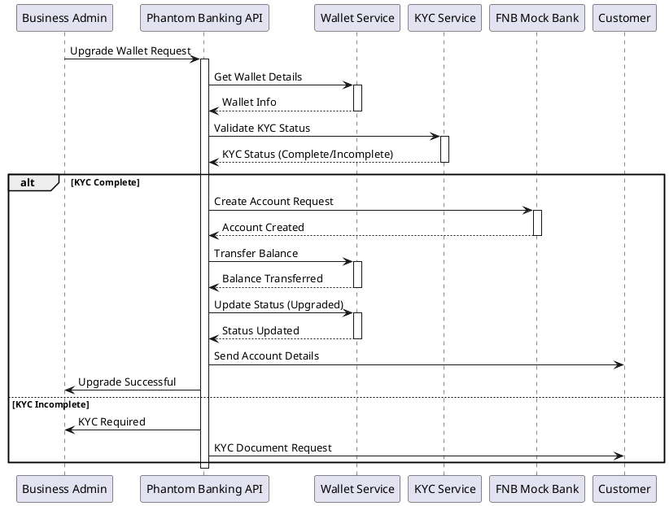

# FNB Phantom Banking - Use Case Analysis & System Documentation

## 🎯 System Actors

### Primary Actors

#### 1. **Business Admin** 
- **Role**: Merchant/Business owner using Phantom Banking services
- **Capabilities**: Register business, manage wallets, process payments, view analytics
- **Goals**: Serve all customers (banked/unbanked), increase revenue, simplify payment processing

#### 2. **Customer** 
- **Role**: End-user making payments through phantom wallets
- **Capabilities**: Make payments via multiple channels, check balances, receive receipts
- **Goals**: Easy payment processing without traditional banking barriers

#### 3. **FNB System** (External)
- **Role**: Core banking system integration partner
- **Capabilities**: Account creation, transaction settlement, compliance verification
- **Goals**: Increase deposits, boost transaction volume, expand customer base

#### 4. **Mobile Money Operator** (External)
- **Role**: Orange Money, MyZaka payment providers
- **Capabilities**: Process mobile payments, settlement to FNB accounts
- **Goals**: Facilitate seamless money transfers, interoperability

### Secondary Actors

#### 5. **FNB Compliance Officer**
- **Role**: Regulatory compliance and KYC verification
- **Capabilities**: Review transactions, approve upgrades, monitor risks
- **Goals**: Ensure regulatory compliance, prevent fraud

#### 6. **System Administrator**
- **Role**: Technical system management
- **Capabilities**: Monitor system health, manage deployments, troubleshoot issues
- **Goals**: Maintain system uptime, ensure security, optimize performance

## 📋 Core Use Cases

### Use Case Diagram (PlantUML)

```plantuml
@startuml
!define RECTANGLE class

actor "Business Admin" as BA
actor "Customer" as CUST
actor "FNB System" as FNB
actor "Mobile Money Operator" as MMO
actor "FNB Compliance Officer" as FCO

rectangle "Phantom Banking System" {
  
  ' Business Management Use Cases
  usecase "Register Business" as UC1
  usecase "Login to Dashboard" as UC2
  usecase "Create Customer Wallet" as UC3
  usecase "Manage Wallet Settings" as UC4
  usecase "View Business Analytics" as UC5
  usecase "Generate Reports" as UC6
  
  ' Payment Processing Use Cases
  usecase "Process QR Payment" as UC7
  usecase "Process USSD Payment" as UC8
  usecase "Process Mobile Money Payment" as UC9
  usecase "Process EFT Payment" as UC10
  usecase "Send Payment Confirmation" as UC11
  
  ' Customer Use Cases
  usecase "Check Wallet Balance" as UC12
  usecase "View Transaction History" as UC13
  usecase "Receive Payment Receipt" as UC14
  
  ' FNB Integration Use Cases
  usecase "Create FNB Account" as UC15
  usecase "Settle Transactions" as UC16
  usecase "Upgrade Phantom Wallet" as UC17
  usecase "Verify KYC Status" as UC18
  
  ' Compliance Use Cases
  usecase "Monitor Transactions" as UC19
  usecase "Flag Suspicious Activity" as UC20
  usecase "Generate Compliance Report" as UC21
  
  ' System Use Cases
  usecase "Send Webhook Notifications" as UC22
  usecase "Process API Requests" as UC23
  usecase "Maintain Audit Trail" as UC24
}

' Actor-Use Case Relationships
BA --> UC1
BA --> UC2
BA --> UC3
BA --> UC4
BA --> UC5
BA --> UC6

CUST --> UC7
CUST --> UC8
CUST --> UC9
CUST --> UC12
CUST --> UC13

FNB --> UC15
FNB --> UC16
FNB --> UC17
FNB --> UC22

MMO --> UC9
MMO --> UC16

FCO --> UC18
FCO --> UC19
FCO --> UC20
FCO --> UC21

' Include/Extend Relationships
UC7 ..> UC11 : <<include>>
UC8 ..> UC11 : <<include>>
UC9 ..> UC11 : <<include>>
UC10 ..> UC11 : <<include>>

UC3 ..> UC15 : <<extend>>
UC17 ..> UC18 : <<include>>

UC7 ..> UC24 : <<include>>
UC8 ..> UC24 : <<include>>
UC9 ..> UC24 : <<include>>

@enduml
```



## 📖 Detailed Use Case Specifications

### UC1: Register Business

**Actors**: Business Admin  
**Preconditions**: Valid business registration documents  
**Postconditions**: Business account created, API keys generated

**Main Flow**:
1. Business admin accesses registration page
2. System displays registration form
3. Admin enters business details (name, email, FNB account, etc.)
4. System validates information
5. System performs KYB (Know Your Business) verification
6. System creates business account
7. System generates API keys
8. System sends welcome email with credentials
9. System notifies FNB of new merchant

**Alternative Flows**:
- **4a**: Invalid information provided
  - System displays validation errors
  - Return to step 3
- **5a**: KYB verification fails
  - System rejects application
  - Send rejection notification

**Business Rules**:
- Valid FNB account number required
- Email must be unique
- Phone number must be valid Botswana format (+267 XX XXX XXX)

---

### UC3: Create Customer Wallet

**Actors**: Business Admin  
**Preconditions**: Business is registered and active  
**Postconditions**: Phantom wallet created for customer

**Main Flow**:
1. Business admin logs into dashboard
2. Admin selects "Create Wallet" option
3. System displays wallet creation form
4. Admin enters customer details (name, phone, email)
5. Admin sets transaction limits
6. System validates customer information
7. System checks for existing wallet
8. System creates phantom wallet
9. System generates unique USSD code
10. System creates audit log entry
11. System displays wallet details to admin

**Alternative Flows**:
- **7a**: Customer already has wallet
  - System displays error message
  - Offer to view existing wallet
- **6a**: Invalid customer information
  - System highlights validation errors
  - Return to step 4

**Business Rules**:
- One wallet per customer per business
- USSD code must be unique system-wide
- Default daily limit: BWP 5,000
- Default monthly limit: BWP 50,000

---

### UC7: Process QR Payment

**Actors**: Customer, Business Admin (indirectly)  
**Preconditions**: Phantom wallet exists, QR code available  
**Postconditions**: Payment processed, wallet balance updated

**Main Flow**:
1. Customer scans QR code at merchant
2. Payment app extracts wallet ID and amount
3. System validates wallet status
4. System checks transaction limits
5. System validates payment amount
6. System processes payment to phantom wallet
7. System updates wallet balance
8. System creates transaction record
9. System notifies FNB for settlement
10. System sends confirmation to customer
11. System sends notification to merchant

**Alternative Flows**:
- **3a**: Wallet inactive or suspended
  - System rejects payment
  - Display error message
- **4a**: Transaction exceeds limits
  - System rejects payment
  - Suggest limit increase
- **9a**: FNB settlement fails
  - System marks transaction as pending
  - Retry settlement process

**Business Rules**:
- Minimum payment: BWP 1.00
- Maximum single payment: BWP 100,000
- Payment must be within daily/monthly limits

---

### UC17: Upgrade Phantom Wallet

**Actors**: Customer, Business Admin, FNB System, FNB Compliance Officer  
**Preconditions**: Active phantom wallet with transaction history  
**Postconditions**: Full FNB account created, wallet status updated

**Main Flow**:
1. Business admin initiates upgrade request
2. System validates wallet eligibility
3. System checks customer KYC status
4. If KYC incomplete, system requests additional documentation
5. Compliance officer reviews KYC documents
6. System creates FNB account via API
7. System transfers phantom wallet balance
8. System updates wallet status to "upgraded"
9. System links wallet to FNB account
10. System sends account details to customer
11. System notifies business of successful upgrade

**Alternative Flows**:
- **3a**: KYC documents insufficient
  - System requests additional documentation
  - Pause upgrade process
- **6a**: FNB account creation fails
  - System logs error
  - Notify business admin
  - Retry with exponential backoff

**Business Rules**:
- Minimum balance required: BWP 100
- KYC must be complete before upgrade
- Account type defaults to CHEQUE account
- Original phantom wallet remains linked for audit

---

## 🔄 System Sequence Diagrams

### Payment Processing Sequence



### Account Upgrade Sequence



## 🎯 Business Goals Alignment

### FNB Strategic Objectives

#### 1. **Increase Deposits** 💰
**Use Cases Supporting This Goal**:
- UC3: Create Customer Wallet → Captures unbanked customer funds
- UC7-UC10: Payment Processing → Channels money into FNB ecosystem
- UC17: Upgrade Phantom Wallet → Converts phantom balances to FNB deposits

**Metrics**:
- Total phantom wallet balances = New deposit potential
- Monthly payment volume = Deposit velocity
- Upgrade conversion rate = Deposit realization

#### 2. **Boost Transaction Volume** 📈
**Use Cases Supporting This Goal**:
- UC7: Process QR Payment → Additional digital transactions
- UC8: Process USSD Payment → Mobile-first transaction growth
- UC9: Process Mobile Money Payment → Cross-platform interoperability

**Metrics**:
- Transaction count per month
- Average transaction value
- Multi-channel payment adoption

#### 3. **Accelerate Digital Onboarding** 🚀
**Use Cases Supporting This Goal**:
- UC1: Register Business → Onboard new merchant partners
- UC3: Create Customer Wallet → Frictionless customer acquisition
- UC17: Upgrade Phantom Wallet → Convert prospects to FNB customers

**Metrics**:
- Time from wallet creation to first transaction
- Conversion rate from phantom wallet to FNB account
- Digital engagement scores

## 🔍 Gap Analysis: Current vs Phantom Banking

### Current FNB Process
```
Customer wants to pay merchant
↓
Customer must have FNB account
↓
If no account: Visit branch, complete KYC, wait for approval
↓
Use FNB banking app or card for payment
↓
Transaction processed
```

**Pain Points**:
- ❌ Excludes unbanked customers
- ❌ High friction for new customers  
- ❌ Merchants lose sales to cash-only customers
- ❌ Limited payment channels

### Phantom Banking Process
```
Customer wants to pay merchant
↓
Merchant creates phantom wallet instantly
↓
Customer pays via QR/USSD/Mobile Money
↓
Payment processed to phantom wallet
↓
Optional: Upgrade to full FNB account later
```

**Advantages**:
- ✅ Includes all customers (banked/unbanked)
- ✅ Zero friction customer onboarding
- ✅ Merchants serve 100% of customers
- ✅ Multiple payment channels supported
- ✅ Gradual path to full banking relationship

## 📊 Use Case Metrics & KPIs

### Business Impact Metrics

| Use Case | Primary Metric | Target | Business Impact |
|----------|----------------|--------|-----------------|
| UC1: Register Business | New merchants/month | 50+ | Expand merchant network |
| UC3: Create Customer Wallet | Wallets created/day | 200+ | Customer acquisition |
| UC7-10: Payment Processing | Transaction volume/month | BWP 10M+ | Revenue growth |
| UC17: Upgrade Phantom Wallet | Conversion rate | 15%+ | FNB customer growth |

### System Performance Metrics

| Use Case | Performance Metric | Target | Importance |
|----------|-------------------|--------|------------|
| UC7: Process QR Payment | Response time | <2 seconds | Customer experience |
| UC8: Process USSD Payment | Availability | 99.9% | Service reliability |
| UC16: Settle Transactions | Settlement time | <30 seconds | Merchant satisfaction |
| UC23: Process API Requests | Throughput | 1000 req/sec | System scalability |

## 🎬 User Stories

### Epic: Serve Unbanked Customers

**As a** business owner  
**I want to** accept payments from customers without bank accounts  
**So that** I can serve 100% of my customers and increase revenue

**Acceptance Criteria**:
- ✅ Create phantom wallets for any customer with just name and phone
- ✅ Accept payments via QR codes, USSD, and mobile money
- ✅ Process payments in real-time with instant confirmation
- ✅ Provide transaction receipts and history
- ✅ Offer path to upgrade customers to full FNB accounts

### Epic: Increase FNB Market Share

**As an** FNB executive  
**I want to** capture deposits and transactions from unbanked customers  
**So that** I can grow market share and achieve digital transformation goals

**Acceptance Criteria**:
- ✅ Track new deposits generated through phantom wallets
- ✅ Monitor transaction volume increase from new payment channels
- ✅ Measure conversion rate from phantom wallets to FNB accounts
- ✅ Demonstrate ROI on phantom banking investment
- ✅ Integrate seamlessly with existing FNB systems

This comprehensive use case analysis demonstrates how Phantom Banking directly addresses FNB's strategic objectives while solving real-world problems for businesses and customers. The system creates a win-win-win scenario:

- **Businesses** can serve all customers and increase revenue
- **Customers** get convenient payment options without banking barriers  
- **FNB** captures new deposits, transactions, and customers while advancing digital transformation goals

The detailed use cases provide a clear roadmap for development and testing, ensuring the final system meets all stakeholder needs and business objectives.